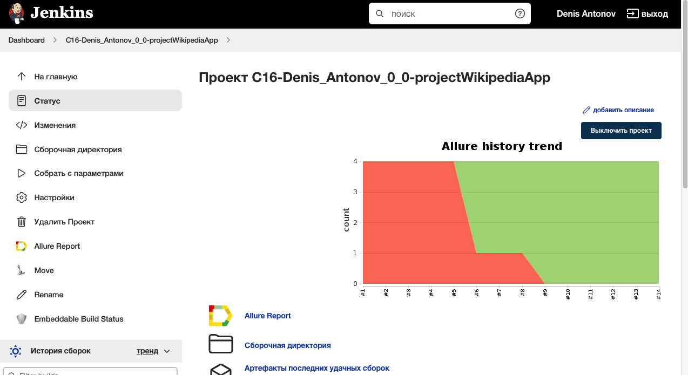
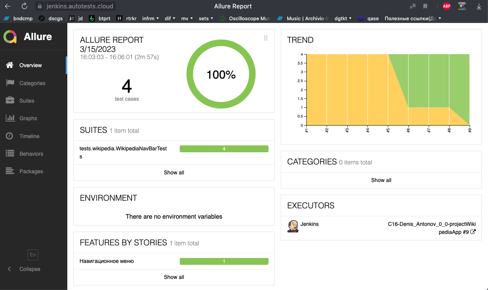
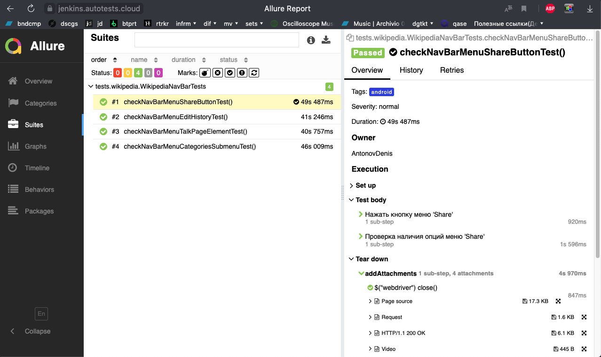
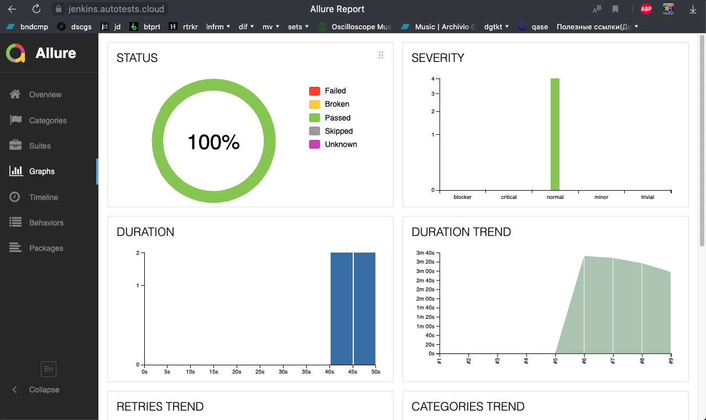
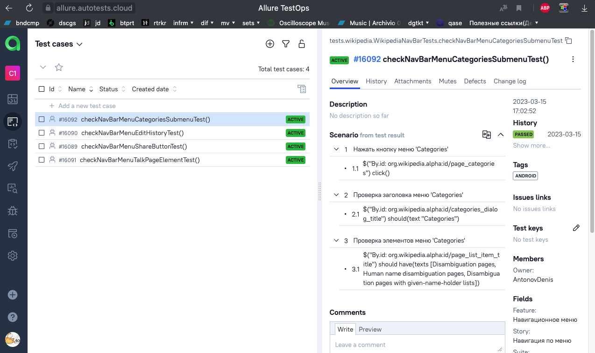
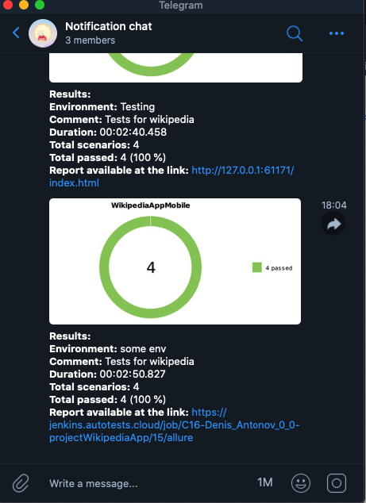

# Проект по автоматизации тестирования для мобильного приложения Wikipedia
<a target="_blank" href="https://www.wikipedia.org/">Веб-сайт Wikipedia</a>

## :scroll: Содержание:

* <a href="#stack">Используемые технологии</a>
* <a href="#verifications">Реализованные проверки</a>
* <a href="#jenkins-build">Параметры сборки в Jenkins</a>
* <a href="#terminal-run">Запуск тестов из терминала</a>
* <a href="#allure-report">Allure отчет</a>
* <a href="#allure-TestOps">Интеграция с Allure TestOps</a>
* <a href="#telegram-notification">Отчет в Telegram</a>
* <a href="#browserstack-video">Видео с примером прохождения тестов</a>

<a id="stack"></a>
## 🔧 Используемые технологии:

<p align="center">
<a href="https://www.jetbrains.com/idea/"></a>
<a href="https://www.java.com/"></a>
<a href="https://github.com/"></a>
<a href="https://junit.org/junit5/"></a>
<a href="https://gradle.org/"></a>
<a href="https://selenide.org/"></a>
<a href="https://github.com/allure-framework/allure2"></a>
<a href="https://www.jenkins.io/"></a>
<a href="https://qameta.io/"></a>
<a href="https://www.java.com"></a>
<a href="https://rest-assured.io/"></a>
<a href="https://www.browserstack.com/"></a>
<a href="https://developer.android.com/studio"></a>
</p>

<a id="verifications"></a>
## :clipboard: Реализованные проверки:

# Mobile testing
- ✓ Провверка кнопки Share в меню навигации
- ✓ Проверка кнопки Edit History в меню навигации
- ✓ Провверка кнопки Categories в меню навигации
- ✓ Провверка кнопки Talk Page в меню навигации

## </a> Jenkins job
<a target="_blank" href="https://jenkins.autotests.cloud/job/C16-Denis_Antonov_0_0-projectWikipediaApp/">Сборка в Jenkins</a>
<p align="center">
<a href="https://jenkins.autotests.cloud/job/C16-Denis_Antonov_0_0-projectWikipediaApp/"></a>
</p>

<a id="jenkins-build"></a>
### Параметры сборки в Jenkins:

- Локальный запуск
- Удаленный запуск в Browserstack

<a id="terminal-run"></a>
## :computer: Запуск тестов из терминала

Локальный запуск:
```bash
gradle clean test -Denv=local
```

Удаленный запуск в Jenkins:
```bash
gradle clean test -DrunSetUp=remote -Denv=remote
```

<a id="allure-report"></a>
## </a> Отчет в <a target="_blank" href="https://jenkins.autotests.cloud/job/C16-Denis_Antonov_0_0-projectWikipediaApp/15/allure/">Allure report</a>

### Основное окно

<p align="center">

</p>

### Тесты

<p align="center">

</p>

### Графики

<p align="center">

</p>


<a id="allure-TestOps"></a>
## </a> Интеграция с Allure TestOps

### Результаты запуска тестов в Allure TestOps

<p align="center">

</p>

### Детализация пройденных тестов в Allure TestOps

<p align="center">

</p>


<a id="telegram-notification"></a>
## </a> Уведомление в Telegram

<p align="center">

</p>

<a id="browserstack-video"></a>
### </a> Видео о прохождении тестов

<p align="center">
 
</p>